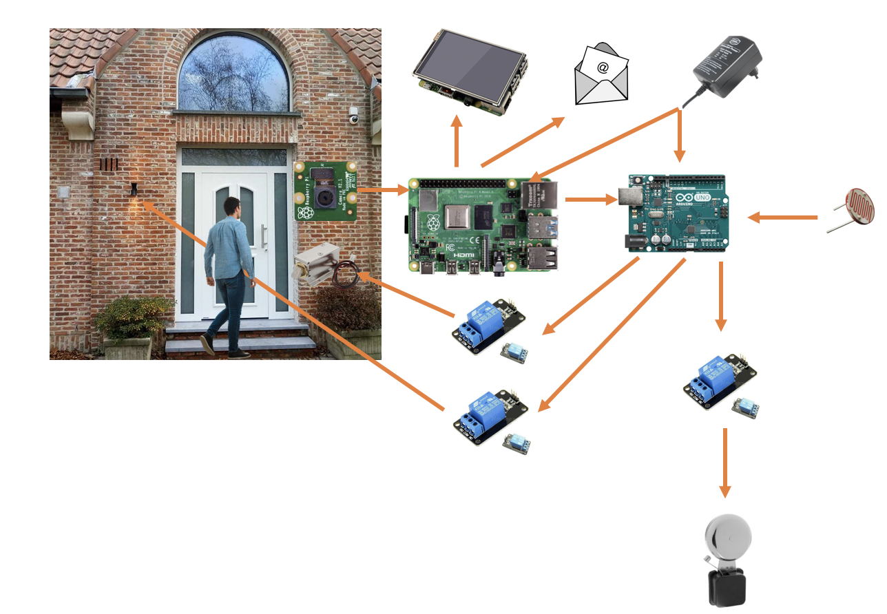
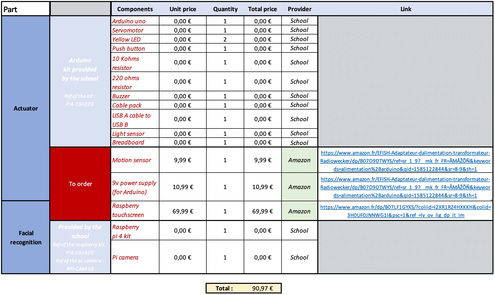

<h1>Home monitoring system</h1>

In order to facilitate access for house residents, a pi camera is placed near the front door, pointing to people wanting to enter. The faces of all the resident of the house are registered beforehand.
Thanks to the Raspberry and the Pi camera, the video stream is analyzed. If the person is recognized by the system and is allowed to enter, the door is unlocked via the Arduino. If the person is not recognized by the system or is not allowed to enter in the house, a doorbell rings to notify the residents of a guest coming in thanks to the Arduino. Furthermore, a picture of the guest is sent to the resident by mail, saved into the Raspberry Pi and displayed on a screen inside the house.
In the event that is dark, and a person is detected by the Raspberry, the outside light is switched on by the Arduino. After a few seconds, the light is switched off.

<h2><u>Summary</u></h2>
<ul>
  <li><strong>Getting started</strong></li>
  <li><strong>Start the program</strong></li>
  <li><strong>Contributing</strong></li>
  <li><strong>Authors</strong></li>
</ul>

<h2><u>Getting started</u></h2>
<h3>prerequisite</h3>
<h4>Material list</h4>

<h3>Installing</h3>

<h2><u>Start the program</u></h2>

<h2><u>Contributing</u></h2>

<h2><u>Authors</u></h2>
<ul>
  <li><strong>Goffin Gerome</strong></li>
  <li><strong>Dupont Corentin</strong></li>
  <li><strong>Josis Arnaud</strong></li>
</ul>
