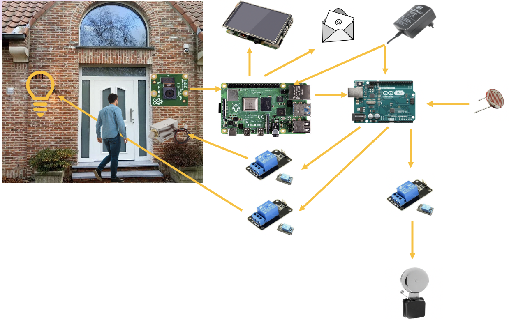

<h1>Home monitoring system</h1>

In order to facilitate access for house residents, a pi camera is placed near the front door, pointing to people wanting to enter.

The faces of all the resident of the house are registered beforehand.

Thanks to the Raspberry and the Pi camera, the video stream is analyzed. If the person is recognized by the system and is allowed to enter, the door is unlocked via the Arduino.

 If the person is not recognized by the system or is not allowed to enter in the house, a doorbell rings to notify the residents of a guest coming in thanks to the Arduino.

Furthermore, a picture of the guest is sent to the resident by mail, saved into the Raspberry Pi and displayed on a screen inside the house.

In the event that is dark, and a person is detected by the Raspberry, the outside light is switched on by the Arduino. After a few seconds, the light is switched off.

<h2><u>Summary</u></h2>
<ul>
  <li><strong>Getting started</strong></li>
  <li><strong>Start the program</strong></li>
  <li><strong>Video</strong></li>
  <li><strong>Contributing</strong></li>
  <li><strong>Authors</strong></li>
</ul>

<h2><u>Getting started</u></h2>
<h3>prerequisite</h3>
<h4>Material list</h4>

<h3>Raspberry PI 4</h3>
<h4>Configuration of the Raspberry Pi 4</h4>
<ol>
	<li>Connect your Raspberry to a power supply and a network via Wifi or via Ethernet</li>
	<li>Enable the ssh on the Rapsberry Pi to control it from your pc</li>
	<ul>
		<li>Enter <code>sudo raspi-config</code> in the terminal window on the Raspberry Pi 4</li>
		<li>Select <code>Interfacing Options</code></li>
		<li>Navigate to and select <code>SSH</code></li>
		<li>Choose <code>Yes</code></li>
		<li>Select <code>Ok</code></li>
		<li>Choose <code>Finish</code></li>
	</ul>
	<li>Connect and enable the Pi Camera</li>
	<b>Be carefull !</b> Disconnect the power of the Raspberry Pi 4 before connect the Pi Camera.
		<ul>
			<li>Enter <code>sudo raspi-config</code> in the terminal</li>
			<li>Select <code>Interfacing Options</code></li>
			<li>Navigate to and select <code>Pi Camera</code></li>
			<li>Choose <code>Yes</code></li>
			<li>Select <code>Ok</code></li>
			<li>Choose <code>Finish</code></li>
		</ul>
	After the restart of the Raspberry, you can test the camera via the command <code>raspistill -o testImage.jpeg</code> or if the camera is upside down <code>raspistill -vf -hf -o testImage.jpeg</code>. There are others parameters for the command, check <a href=https://www.raspberrypi.org/documentation/raspbian/applications/camera.md> here</a>.
	You can also try a python test program, <a href=https://github.com/corentindpt/group3-Home_monitoring_system/tree/master/Programs/TestCamera> see /Programs/TestCamera</a>.
	<li>Update the Raspberry Pi 4 os and the installed packages</li>
		<ul>
			<li>Enter <code>sudo apt update</code> in the terminal</li>
			<li>Enter <code>sudo apt full-upgrade</code> in the terminal</li>
		</ul>
</ol>
<h4>Installing</h4>
<ol>
	Here is the list of the needed libraries. All these librairies, must be installed with python <strong>version 3.6.</strong>
	<ul>
		<li>Numpy (version : 1.18.3)</li>
		<li>Matplotlib (version : 3.2.1)</li>
		<li>imutils (version : 0.5.3)</li>
		<li>Scipy (version : 1.4.1)</li>
		<li>Keras (version : 2.3.1)</li>
		<li>TensorFlow (version : 1.14.0)</li>
		<li>Pickle (version : 4.0)</li>
		<li>Dlib (version : 19.19.0)</li>
		<li>Opencv (version : 4.0.0 )</li>
		<li>PiCamera (version : 1.13)</li>
	</ul>
	<li>Install numpy library</li>
		<ul>
			<li>Enter <code>pip install numpy</code> in the terminal</li>
		</ul>
	<li>Install matplotlib library</li>
		<ul>
			<li>Enter <code>pip install matplotlib</code> in the terminal</li>
		</ul>
	<li>Install imutils library</li>
		<ul>
			<li>Enter <code>pip install imutils</code> in the terminal</li>
		</ul>
	<li>Install scipy library</li>
		<ul>
			<li>Enter <code>pip install scipy</code> in the terminal.
				This step takes a long time (2-3 hours). You can revise your SI course during this period :-).
			</li>
		</ul>
	<li>Install keras library</li>
		<ul>
			<li>Enter <code>pip install keras</code> in the terminal.</li>
		</ul>
	<li>Install tensorflow library</li>
		<ul>
			<li>Enter <code>pip install tensorflow</code> in the terminal.</li>
		</ul>
	<li>Install pickle library</li>
		<ul>
			<li>Normally, pickle is already installed on the raspberry. If not,
				enter <code>pip install pickle</code> in the terminal.</li>
		</ul>
	<li>Install dlib library</li>
		<ul>
			We have installed dlib with GPU support.
			<li>Enter <code>git clone https://github.com/davisking/dlib.git</code> in the terminal.</li>
			<li>Enter <code>cd dlib</code> in the terminal.</li>
			<li>Enter <code>mkdir build</code> in the terminal.</li>
			<li>Enter <code>cd build</code> in the terminal.</li>
			<li>Enter <code>cmake .. -DDLIB_USE_CUDA=1 -DUSE_AVX_INSTRUCTIONS=1</code> in the terminal.</li>
			<li>Enter <code>cmake --build</code> in the terminal.</li>
			<li>Enter <code>cd ..</code> in the terminal.</li>
			<li>Enter <code>python setup.py install --yes USE_AVX_INSTRUCTIONS --yes DLIB_USE_CUDA</code> in the terminal.</li>
			if it doesn’t works, you can try the installing without the GPU support :
			<li>Enter <code>pip install dlib</code> in the terminal.</li>
		</ul>
	<li>Install OpenCv</li>
		<ul>
			<li><code>sudo pip install opencv-contrib-python</code></li>
		</ul>
	<li>Install PiCamera</li>
		<ul>
			<li><code>pip install picamera</code></li>
		</ul>

</ol>

<h3>MQTT</h3>
<h4>Set up</h4>
It is necessary to create an mqtt broker (<a href=https://www.maqiatto.com>maqiatto.com</a>) and to create the following topics.
<h4>Topics</h4>
<ul>
	  <li>etu30673@henallux.be/si/option</li>
	<ul>
		<li>This topic allows you to send instructions to raspberry (recognition) to perform a task or an other</li>
	</ul>
	  <li>etu30673@henallux.be/si/recognition</li>
	<ul>
		<li>This section allows the arduino to read the output of the recognition program.</li>
	</ul>
	
  <li>etu30673@henallux.be/si/prenom</li>
  <ul>
		<li>This topic allows you to send the first name of the person you want to add to the database. The first name must be written without an accent</li>
	</ul>
  <li>etu30673@henallux.be/si/nom</li>
  <ul>
		<li>This topic allows you to send the last name of the person you want to add to the database.</li>
	</ul>
  <li>etu30673@henallux.be/si/suppression</li>
  <ul>
		<li>This topic allows you to send "Firstname_Lastname" of the person you want to remove from the database.</li>
	</ul>
  <li>etu30673@henallux.be/si/chemin</li>
  <ul>
		<li>This topic allows you to add photos of a person to the database.</li>
	</ul>
</ul>
<h4>

<h3>Dashboard Nodered</h3>
The dashboard allows you to control facial recognition via MQTT requests.
All this is done using buttons and input zones.

On this dashboard there is also the camera feed corresponding in reality to the display of a photo every 2 seconds.
There is also weather data from the city of Virton, Belgium. These are "http requests" on the <a href=https://www.openweathermap.org> openweathermap.org</a> site.

<h4>Pallets required</h4>
<ul>
	  <li><strong>node-red-contrib-camerapi</strong></li>
	<ul>
		<li>To interact with the pi camera.</li>
	</ul>
	  <li><strong>node-red-contrib-moment</strong></li>
	<ul>
		<li>To access the time and date.</li>
	</ul>
  <li><strong>node-red-dashboard</strong></li>
  <ul>
		<li>To have access to various display modules. Example: buttons.</li>
	</ul>
  <li><strong>node-red-node-base64</strong></li>
  <ul>
		<li>For encoding photos.</li>
	</ul>
  <li><strong>node-red-node-serialport</strong></li>
  <ul>
		<li>To make communication via the serial port with the arduino possible.</li>
	</ul>
  <li><strong>node-red-contrib-ui-media</strong></li>
  <ul>
		<li>To display an image stored locally.</li>
	</ul>
</ul>

<h2><u>Start the program</u></h2>
<ol>
	<li>Install the <a href=https://github.com/corentindpt/group3-Home_monitoring_system/tree/master/Programs/Actuators_programs/Program_final> arduino program</a> to control actuators</li>
	<li>Connect the arduino to the USB port of the raspberry pi. Don't forget to update the connected port of the raspberry on NodeRed</li>
	<li>Download <a href=https://github.com/corentindpt/group3-Home_monitoring_system/tree/master/Programs/Programs_VGG> Programs_VGG</a></li>
	<li>Download this<a href=http://www.vlfeat.org/matconvnet/models/vgg-face.mat> file</a> and place it to Programs_VGG/createModem/vgg-face.mat</li>
	<li>Start NodeRed on Raspberry Pi4 : <code>node-red</code></li>
	<li>Import <a href=https://github.com/corentindpt/group3-Home_monitoring_system/blob/master/Programs/DashboardHomeMonitoringSystem.json> NodeRed program</a> on the raspberry and install pallets required.</li>
	<li>Start the main program <code>python mainProgramm.py</code></li>
</ol>

<h2>Video</h2>
<li><a href=https://raspberry-valley.azurewebsites.net/Python-Default-Version/> Clique here</a></li>
<h2><u>Contributing</u></h2>
<li><a href=https://raspberry-valley.azurewebsites.net/Python-Default-Version/> https://raspberry-valley.azurewebsites.net/Python-Default-Version/</a></li>
<li><a href=https://www.pyimagesearch.com/2018/06/18/face-recognition-with-opencv-python-and-deep-learning/> https://www.pyimagesearch.com/2018/06/18/face-recognition-with-opencv-python-and-deep-learning/</a></li>
<li><a href=https://www.pyimagesearch.com/2018/06/11/how-to-build-a-custom-face-recognition-dataset/ > https://www.pyimagesearch.com/2018/06/11/how-to-build-a-custom-face-recognition-dataset/</a></li>
<li><a href=https://www.pyimagesearch.com/2019/09/16/install-opencv-4-on-raspberry-pi-4-and-raspbian-buster/>https://www.pyimagesearch.com/2019/09/16/install-opencv-4-on-raspberry-pi-4-and-raspbian-buster/</a></li>
<li><a href=https://www.pyimagesearch.com/2018/03/12/python-argparse-command-line-arguments/>https://www.pyimagesearch.com/2018/03/12/python-argparse-command-line-arguments/</a></li>
<li><a href=https://www.carnetdumaker.net/articles/controler-un-servomoteur-avec-une-carte-arduino-genuino/>https://www.carnetdumaker.net/articles/controler-un-servomoteur-avec-une-carte-arduino-genuino/</a></li>
<li><a href=https://raspberrypi.stackexchange.com/questions/26286/update-python-version-on-raspbian> https://raspberrypi.stackexchange.com/questions/26286/update-python-version-on-raspbian</a></li>
<li><a href=https://stackoverflow.com/questions/60252119/error-environment-users-myuser-virtualenvs-iron-does-not-contain-activation-s/60292344#60292344> https://stackoverflow.com/questions/60252119/error-environment-users-myuser-virtualenvs-iron-does-not-contain-activation-s/60292344#60292344</a></li>
<li><a href=https://towardsdatascience.com/vgg-neural-networks-the-next-step-after-alexnet-3f91fa9ffe2c> https://towardsdatascience.com/vgg-neural-networks-the-next-step-after-alexnet-3f91fa9ffe2c</a></li>
<li><a href=https://en.wikipedia.org/wiki/Histogram_of_oriented_gradients> https://en.wikipedia.org/wiki/Histogram_of_oriented_gradients</a></li>
<li><a href=https://aboveintelligent.com/face-recognition-with-keras-and-opencv-2baf2a83b799> https://aboveintelligent.com/face-recognition-with-keras-and-opencv-2baf2a83b799</a></li>

<h2><u>Authors</u></h2>
<ul>
  <li><strong>Goffin Gerome</strong></li>
  <li><strong>Dupont Corentin</strong></li>
  <li><strong>Josis Arnaud</strong></li>
</ul>
